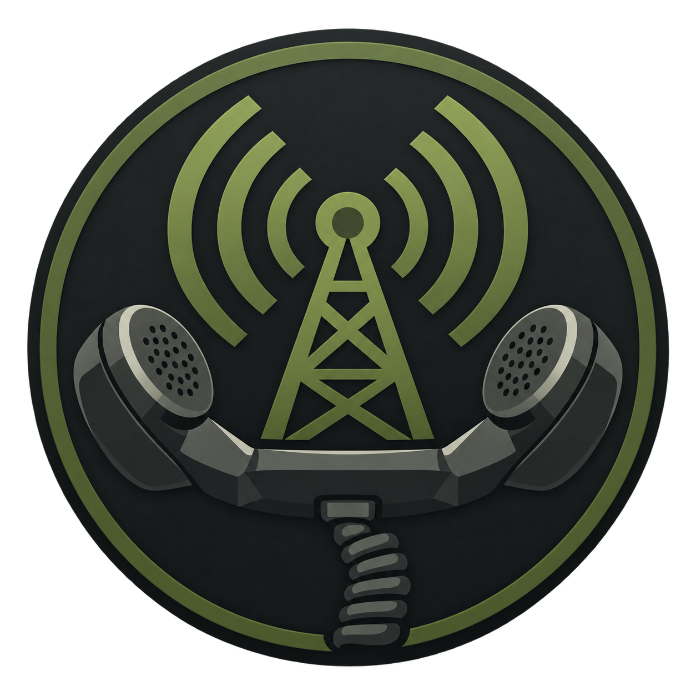

<p align="center">
  
</p>

<h1 align="center">WARDOGS Radio</h1>

<p align="center">
  <strong>Your own in-game radio station, music library, and audio control console.</strong>
</p>

<p align="center">
  Windows 10/11 • Current release: <strong>v0.3.2</strong>
</p>

WARDOGS Radio is a Windows desktop app for playing music through your headset **and** your in-game voice output without having to rebuild an audio-routing science experiment every time you launch a game.

Create stations like **Cruise**, **Combat**, **Night Ops**, or **Extraction**. Fill them with local music or online sources. Switch between them with a keyboard shortcut or HOTAS/controller button. Split a one-hour YouTube music compilation into individual reusable songs without downloading or cutting the original video. Watch your final broadcast level. Save everything. Launch it again later and your radio is still there.

In other words: it is much closer to a little airborne radio console than a normal playlist player.

> **Fresh install? You do not need to hunt down dependencies yourself.** The installer bundles portable MPV and offers the official **Microsoft Edge WebView2 Runtime** and **Voicemeeter Banana** installers when needed. Automatic routing requires Banana and starts its engine during app launch when safe. Voicemeeter's virtual-audio driver still requires Windows administrator approval and a restart.


---

## What can WARDOGS Radio do?

### 📻 Build real stations

Stations are independent, editable radio presets with their own music and playback behavior.

A setup might look like:

```text
🚁 CRUISE
Classic rock / transport music

💀 COMBAT
Hard rock / high-energy music

🌙 NIGHT OPS
Dark atmospheric music

🏠 EXTRACTION
Victory / return-flight music
```

Rename them. Reorder the music. Shuffle them. Disable ones you are not using. Change what they play. Make completely new stations.

The built-in **Cruise, Combat, Comms, and Emergency** entries are simply editable starter templates, not hard-coded special modes.

---

### ✂️ Turn a long YouTube compilation into individual songs

This is one of the coolest parts of WARDOGS Radio.

Suppose you find a one-hour YouTube music compilation containing a bunch of songs you want. Normally you either play the entire video in its original order, hunt down every song individually, or start manually editing media files because apparently free time is offensive.

WARDOGS Radio can treat the original video as a **Source** and create named song ranges inside it:

```text
Original YouTube source
────────────────────────────────────────────────

12:34 ───────────── 15:41
        Fortunate Son

20:18 ───────────── 23:57
        Paint It, Black

31:02 ───────────── 38:16
        Riders on the Storm
```

Those new songs are only lightweight timing references to the original media.

**Nothing is downloaded. Nothing is duplicated. Nothing is destructively cut.**

You can then treat each section like a normal song: name it, preview it, adjust its timing, reorder it, shuffle it, and reuse it on other stations.

For a compatible local track or single YouTube video:

1. Start playing the source.
2. Seek to the place where you want to divide it.
3. Right-click the timeline and choose **Create New Song**.
4. Name the new section.
5. Fine-tune its start/end time if needed.
6. Save it to the Library and/or current station.

This is especially useful for long music mixes, compilations, soundtrack uploads, DJ sets, and other single-video sources.

> **Current limitation:** multi-video YouTube playlists can be played, but they are not currently exposed as one continuous source timeline that can be split into named ranges.

---

### 📚 Reuse songs with the Music Library

WARDOGS Radio separates music into three simple layers:

```text
SOURCE
  ↓
SONG
  ↓
STATION PLAYLIST
```

A **Source** is the original media, such as a local file or a single YouTube video.

A **Song** is a reusable item from that source. It may be the whole track, or just a start/end section from a longer compilation.

A **Station Playlist** simply chooses which Library songs that station should play, and in what order.

That means the same song can be used everywhere without creating copies:

```text
Fortunate Son
├── Cruise
├── Combat
└── Extraction
```

Edit the song once and every station using it sees the corrected version.

**Remove from This Station** only removes that station's reference.

**Delete from Library** is the larger action and clearly warns you before removing the song from every station that uses it.

Stations also have **Add from Library**, including multi-select, so building a new station from music you have already identified is fast.

The Library also includes a **Source Archive**, letting you inspect compatible original sources and work directly from their timelines.

---

### 🎛️ Macros, keybinds, and HOTAS controls

You should not have to Alt+Tab in the middle of a flight just to change the music.

WARDOGS Radio includes editable **Macros** that can be triggered from keyboard or supported controller/HOTAS bindings.

The default macros use **F9–F12**, but the bindings and actions are customizable.

Macros can do things such as:

- select a specific station
- cycle through enabled stations
- play the current station
- pause the current station
- toggle between two sets of actions
- change the **Headset Master** level
- change the **Game Master** level
- restore the previous Headset or Game Master level
- temporarily duck music while a button is held
- combine multiple radio actions into one control

For example:

```text
HOTAS HAT ↑  → Cruise
HOTAS HAT →  → Combat
HOTAS HAT ↓  → Comms
HOTAS HAT ←  → Emergency
```

Or make a hold macro behave like a simple aircraft intercom:

```text
Hold comms button
        ↓
Game music lowers

Release button
        ↓
Previous music level returns
```

Macros also perform health checks. If an action depends on something that is unavailable, WARDOGS Radio reports that instead of cheerfully pretending the button worked.

---

### 🎚️ Keep playback controls everywhere

The persistent **Now Playing** surface stays available throughout the app, so you do not need to keep returning to the Dashboard.

It provides:

- current station
- current song
- previous / play-pause / next
- repeat control
- station selection
- playback progress
- timeline seeking
- live visualizer
- compact and expanded views

The Dashboard and Now Playing surface share the same live playback state.

While the main WARDOGS Radio window has focus, **Enter** or **Space** toggles play/pause unless you are currently typing into a text field.

---

### 🎧 Play local music and online sources

WARDOGS Radio can work with several types of media.

#### Local music

Add:

- individual files
- several files at once
- folders
- M3U / M3U8 playlist files

Local playlists can be reordered, shuffled, segmented into song cues, and reused through the Music Library.

The installer already includes a portable MPV build, so a normal WARDOGS Radio installation does **not** require you to separately install MPV.

#### YouTube

WARDOGS Radio can:

- play compatible YouTube sources inside the app
- use transport and timeline controls
- turn compatible single-video sources into named Library songs

The YouTube playback surface uses WebView2 and YouTube's player interface rather than launching a pile of external browser windows.

#### SoundCloud and Apple Music

These providers are recognized, but remain marked **Setup Required** until their official authorization requirements are configured.

WARDOGS Radio does not ship credentials or fake a healthy provider connection because lying to the user is, surprisingly, not a feature.

---

### 🔊 Route music into your game

WARDOGS Radio uses **Voicemeeter Banana** as its supported audio-routing backend. The Audio Bridge attempts to start and connect Banana at launch. Setup & Repair then asks you to choose a microphone and headphones, connect the game-voice path, and verify it with live checks.

At a high level:

```text
Local station ──→ MPV headset player ──→ selected headphones
             └─→ MPV game player ──────→ Banana AUX ──→ B1 game input
Microphone ────────────────────────────→ Banana physical input ──→ B1
```

This lets you monitor your radio in your own headset while also sending the intended mix into a game's voice input.

The five-step **Setup & Repair** flow uses the same readiness checks as Dashboard and Diagnostics. Audio & Routing retains the advanced strip, bus, and meter details. A moving B1 meter confirms the measured output, while game reception still needs your confirmation.

For YouTube playback, the current review candidate routes the player's audio session to the selected listening output and sends a separate game-feed copy to Voicemeeter. It records and restores its per-app route without changing the Windows global default for new sessions. The [Audio Bridge candidate and live acceptance plan](docs/ReadinessAudioBridgeCandidate.md) describes the remaining hardware checks and limitations.

---

### 🛡️ Watch the final mix with Output Health and Clip Guard

Your music can look safe.

Your microphone can look safe.

Then the two combine and the final B1 output clips anyway, because audio enjoys inventing new ways to embarrass everyone.

**Output Health** watches the actual local mix and shows:

- music-strip peak
- microphone peak
- final B1 / game-mix peak
- digital headroom
- short peak holds
- clip events
- recent output events

Remember: **0 dBFS is the digital ceiling.**

A 100% volume slider is only a requested level. It does not prove the final combined broadcast is safe.

**Clip Guard** has three modes:

- **Off** – telemetry remains visible
- **Monitor** – watch and warn
- **Protect** – when supported, temporarily reduce the dedicated game-music feed during persistent unsafe output

Protect mode does not move your microphone, station, Headset Master, or Game Master sliders.

If safe protection is not available, WARDOGS Radio reports that condition rather than adjusting the wrong audio path.

The optional **Voicemeeter Limiter** control can also lease the documented limiter on the selected music strip and restore the previous mixer value when released.

Use **Broadcast Level Test** while playing a loud station and speaking normally to observe the real local Voicemeeter mix. If B1 is too hot, WARDOGS Radio can offer an explicit safer Game Master recommendation.

See [Output Health](docs/OutputHealth.md) for the detailed protection and verification model.

---

### 💾 Back up your whole radio

WARDOGS Radio can create a portable backup of its configuration and Music Library.

Backups preserve relationships between:

- stations
- sources
- songs
- playlists
- macros
- application configuration

Restore validates the package before applying changes.

Normal settings are stored under:

```text
%LOCALAPPDATA%\WARDOGS Radio
```

with a last-known-good backup.

---

## Dependencies — handled by the installer

For a normal supported installation, **you do not need to manually install WARDOGS Radio's runtime dependencies first.**

v0.2.4 ships with everything needed to handle the supported playback and routing stack:

| Component | What WARDOGS Radio does |
| --- | --- |
| **MPV** | Portable MPV is bundled directly with WARDOGS Radio. No separate MPV install is needed. |
| **Microsoft Edge WebView2 Runtime** | The installer checks whether WebView2 already exists. If it is missing, the bundled official Microsoft installer is selected automatically and installs it silently. |
| **Voicemeeter Banana** | The installer checks for Banana. If it is missing, the bundled official VB-Audio Banana installer is selected automatically. Potato alone does not satisfy the supported automatic-routing requirement. |

### Voicemeeter Banana

Voicemeeter Banana is still the audio-routing backend used for the supported music/microphone mix, B1 game output, live strip/bus metering, and several Output Health features.

The important difference in **v0.2.4** is that **you do not need to go download and install it separately before WARDOGS Radio**.

If Banana is already installed, WARDOGS Radio leaves the installation alone. If another Voicemeeter edition is running, WARDOGS reports that automatic routing needs Banana and does not replace the running mixer.

If Banana is not installed, the WARDOGS Radio installer offers the bundled official Banana setup automatically.

Because Voicemeeter installs a Windows virtual-audio driver, Windows will still require:

1. administrator approval for the VB-Audio installer
2. a Windows restart after the driver installation

WARDOGS Radio does not silently bypass either of those system requirements, and uninstalling WARDOGS Radio does not remove the shared Voicemeeter installation.

### Microsoft Edge WebView2 Runtime

WebView2 powers WARDOGS Radio's in-app YouTube/web playback surface.

If WebView2 is already installed, nothing is changed.

If it is missing, the WARDOGS Radio installer automatically selects the bundled official Microsoft Evergreen WebView2 Runtime installer and installs it silently.

### Portable MPV

MPV is packaged directly with WARDOGS Radio and is used for local music and compatible native/stream playback.

There is nothing extra to install, and WARDOGS Radio does not modify an unrelated system-wide MPV installation.

> Advanced users can deliberately uncheck a missing prerequisite on the installer page, but WARDOGS Radio warns which feature will remain unavailable. For the normal supported setup, simply leave the automatically selected prerequisites enabled.

---

## First Launch

WARDOGS Radio is designed so the complicated audio setup happens **once**, not every time you want to play.

### 1. Run the WARDOGS Radio installer

Download **WARDOGS Radio v0.3.2** from [GitHub Releases](https://github.com/Kgray44/Wardogs_Radio/releases/latest) and run the installer.

You do **not** need to prepare MPV, WebView2, or Voicemeeter beforehand.

The installer checks the machine and shows a **Prerequisites** page:

- already-installed components are left alone
- missing WebView2 is selected automatically and installed silently
- missing Voicemeeter Banana is selected automatically and launches the official VB-Audio installer
- portable MPV is already included with WARDOGS Radio

If Voicemeeter needs to be installed, approve its administrator prompt and **restart Windows after the VB-Audio setup completes**. That restart is required for its virtual audio driver to become available.

### 2. Finish installing WARDOGS Radio

The main WARDOGS Radio application installs per-user under:

```text
%LOCALAPPDATA%\Programs\WARDOGS Radio
```

and creates a Start Menu shortcut to **WARDOGS Radio Launcher**.

On a machine that already has WebView2 and Voicemeeter, the installer simply skips those prerequisite installs. On a fresh machine, it handles them as part of the same setup flow.

### 3. Open the Setup Wizard

The **Setup Wizard** guides the important audio choices one step at a time.

You will work through:

1. microphone selection
2. Voicemeeter music-strip mapping
3. headset/listening routing
4. the B1 game-facing output
5. live signal checks
6. listening checks
7. game-receive verification

Device and route selections apply immediately, and the wizard can restore routes it changed.

WARDOGS Radio deliberately keeps these states separate:

```text
Detected
Configured
Connected
Verified
```

A meter moving proves that WARDOGS Radio can see local signal activity. It does **not** automatically prove that the game accepted the final B1 mix.

### 4. Set up your stations

Edit the starter stations or create your own.

Add local music, online sources, or songs from the Library.

If you found a long YouTube compilation you want to use, this is a perfect time to load it and start creating individual named song cues from its timeline.

### 5. Set up macros and keybinds

Open the Macros page and decide what you want available while the game has focus.

The defaults use **F9–F12**, but you can assign your own keyboard and supported controller/HOTAS bindings.

For most people, useful first bindings are:

```text
F9   → Cruise
F10  → Combat
F11  → Comms
F12  → Emergency
```

From there you can get considerably more irresponsible with hold macros, station cycling, volume ducking, and HOTAS controls.

### 6. Run a quick broadcast check

Play one of your louder stations and speak normally.

Open **Audio & Routing** and use Output Health / Broadcast Level Test to make sure the music-plus-microphone mix has reasonable headroom.

Once that is done, ordinary sessions become:

```text
Launch WARDOGS Radio
        ↓
Choose a station or hit a keybind
        ↓
Launch / play your game
        ↓
Become a deeply questionable airborne radio station
```

---

## Playlist controls and playback behavior

The Dashboard playlist is interactive.

You can:

- double-click a song to play it
- drag songs to reorder them
- add compatible songs from the Library
- shuffle the physical playlist order
- seek through known-duration media
- create named song cues from compatible source timelines
- edit existing song names and start/stop points

The repeat button cycles through:

1. **Off** – stop at the end
2. **Station** – repeat the full playlist
3. **Track** – repeat the current song

**Station** is the default.

The Previous button restarts the current song when playback is already more than five seconds in. Near the beginning of the song, it moves to the previous song instead.

### Station return modes

WARDOGS Radio also supports different ways of handling a station while you are tuned somewhere else:

- **Player Mode** restores the saved song and position.
- **Radio Mode** can advance compatible local playlists based on elapsed time while tuned away.
- **Restart Track** restarts the last song from its beginning when you return.

Sources without reliable duration information safely fall back to their saved position and report the limitation.

---

## Diagnostics

The **Diagnostics** page exists for the traditional Windows experience of having audio in one place and absolutely none in another.

It reports information such as:

- Voicemeeter installation state
- Remote API connection state
- selected strips and buses
- detected devices
- configured routes
- verification state
- live meter activity
- macro/action health
- output telemetry mismatches

Exported diagnostic reports are Markdown and can include local device names or file paths, so review them before posting publicly.

More detail is available in [Diagnostics](docs/Diagnostics.md) and [Audio Routing](docs/AudioRouting.md).

---

## System tray behavior

Clicking the title-bar **X** minimizes WARDOGS Radio to the system tray instead of fully shutting it down.

To completely exit and restore any temporary route owned by WARDOGS Radio, use:

**Tray icon → Exit**

---

## Updates

The Start Menu shortcut launches **WARDOGS Radio Launcher**.

The Launcher:

- checks official stable GitHub Releases
- verifies the release manifest
- verifies the installer SHA-256
- installs verified updates
- health-checks the updated application
- still launches the installed copy if update checking fails

v0.3.2 makes a disconnected selected microphone or listening output unmistakable in the header and prevents GAME VOICE from claiming READY while either is missing. v0.3.1 fixed the launcher timeout for large installer downloads. v0.3.0 simplified Setup & Repair, added the Banana Audio Bridge, and improved local and YouTube listening and game-output routing. Portable MPV is included, while missing WebView2 and Voicemeeter Banana are supplied through bundled official installers and only invoked when needed. Existing compatible installations are detected and left alone. Install v0.3.2 manually once if upgrading from v0.3.0 or earlier; those launchers can time out before finishing the installer download.

An installed copy does **not** require internet access merely to launch and use local functionality.

The installer therefore handles the full supported runtime dependency stack without making a new user hunt down separate downloads. It does not bundle or alter:

- account credentials
- provider authorization
- an existing system-wide MPV installation

WARDOGS Radio settings are intentionally kept separate from installed program files.

---

## More documentation

- [Music Library Architecture](docs/MusicLibraryArchitecture.md)
- [Playback Providers](docs/PlaybackProviders.md)
- [Audio Routing](docs/AudioRouting.md)
- [Output Health](docs/OutputHealth.md)
- [Diagnostics](docs/Diagnostics.md)
- [Backup & Transfer](docs/BackupTransfer.md)
- [Architecture](docs/Architecture.md)

---

## Development

Development requires the .NET 10 SDK on Windows.

From the repository root:

```powershell
dotnet test WardogsRadio.sln -c Release
node tests/youtube-player.behavior.test.cjs
dotnet publish .\src\WardogsRadio.App\WardogsRadio.App.csproj -c Release -r win-x64 --self-contained true -o .\artifacts\win-x64
```

Run:

```text
artifacts\win-x64\WARDOGS Radio.exe
```

The [Build and test workflow](.github/workflows/build.yml) produces the same Windows x64 application after automated checks.

No owner music, credentials, personal settings, or local build artifacts are intended to be committed.

---

## Current release

**v0.3.2**

[Download the latest WARDOGS Radio release](https://github.com/Kgray44/Wardogs_Radio/releases/latest)
